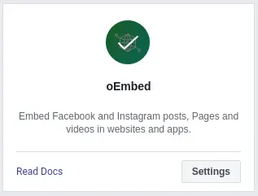

See how to embed Facebook page, post, and video in Hugo as shortcodes.
<!--more-->


Facebook announced [**v11.0**](https://developers.facebook.com/docs/graph-api/changelog/version11.0) of the Graph API and Marketing APIs. With this update, there are new requirements to be able to access [**oEmbed APIs**](https://developers.facebook.com/docs/plugins/oembed/). To continue accessing the oEmbed APIs, you will have to [submit your app](https://developers.facebook.com/docs/plugins/oembed/) for review by **September 6th, 2021**. If you want to request new access to the oEmbed APIs, you will also need to submit your app(s) for review.


## About Facebook oEmbed
Facebook oEmbed endpoints allow you to get embed HTML and basic metadata for pages, posts, and videos in order to display them in another website or app.

## How to Implement
### Facebook App Configuration

> If you are coming from "[_Instagram Shortcodes in Hugo_](/instagram-shortcode-in-hugo)", just skip this step.

1. Create an app in [Facebook Developers Page](https://developers.facebook.com/)
2. Add [_oEmbed_](https://developers.facebook.com/docs/plugins/oembed) to your facebook app
3. Don't forget to activate _oEmbed_ plugin

4. Find and copy _App ID_ in top left corner and use it for `.Site.Params.oembed.appId`
5. Go to Settings > Advanced > Security
6. Copy _Client Token_ and use it for `.Site.Params.oembed.clientToken`


### Theme Configuration
After you get both _App ID_ and _Client Token, follow these instruction below:

1. Create an `oembed.html` in `YourProject/layouts/shortcodes`

   At this point we will integrate url query string parameter for Facebook Page, Post, and Video.
The `$type` parameter with `page` will stand for Facebook Page, `post` for Facebook Post, and `video`  for Facebook Video. The `fb` parameter will confirm that the oEmbed used is for Facebook.

   ```html
   {{- $oe := .Site.Params.oembed -}}
   {{- $appId := $oe.appId -}}
   {{- $clientToken := $oe.clientToken -}}
   {{- if not $oe.privacy -}}
   {{ $host := .Get 0 }}
   {{ $type := .Get 1 }}
   {{ $id := .Get 2 }}
   {{- if eq $type "page" -}}
   {{ with getJSON "https://graph.facebook.com/v11.0/oembed_" $type "?url=" $id "&show_posts=false" "&access_token=" $appId "|" $clientToken }}{{ .html | safeHTML }}{{ end }}
   {{- else -}}
   {{ with getJSON "https://graph.facebook.com/v11.0/oembed_" $type "?url=" $id "&access_token=" $appId "|" $clientToken }}{{ .html | safeHTML }}{{ end }}
   {{- end -}}
   {{- end -}}
   ```
   
   If you are coming from "[_Instagram Shortcodes in Hugo_](/instagram-shortcode-in-hugo)", you can combine both Facebook and Instagram into one shortcode by copy this code below.

   ```html
   {{- $oe := .Site.Params.oembed -}}
   {{- $appId := $oe.appId -}}
   {{- $clientToken := $oe.clientToken -}}
   {{- if not $oe.privacy -}}
   {{ $host := .Get 0 }}
   {{ $type := .Get 1 }}
   {{ $id := .Get 2 }}
   {{- if eq $host "ig" -}}
   {{ $hideCaption := cond (eq (.Get 3) "hidecaption") "1" "0" }}
   {{ with getJSON "https://graph.facebook.com/v11.0/instagram_oembed/?url=https://instagram.com/" $type "/" $id "/&hidecaption=" $hideCaption "&access_token=" $appId "|" $clientToken }}{{ .html | safeHTML }}{{ end }}
   {{- else if eq $host "fb" -}}
   {{- if eq $type "page" -}}
   {{ with getJSON "https://graph.facebook.com/v11.0/oembed_" $type "?url=" $id "&show_posts=false" "&access_token=" $appId "|" $clientToken }}{{ .html | safeHTML }}{{ end }}
   {{- else -}}
   {{ with getJSON "https://graph.facebook.com/v11.0/oembed_" $type "?url=" $id "&access_token=" $appId "|" $clientToken }}{{ .html | safeHTML }}{{ end }}
   {{- end -}}
   {{- end -}}
   {{- end -}}
   ```
   You can adjust more available JSON's parameters in every endpoint type, just go to take a look this table below.

   | Endpoint | Description |
   | -------- | ----------- |
   | [GET /oembed_page](https://developers.facebook.com/docs/graph-api/reference/oembed-page/) | Get a Facebook page's embed HTML and basic metadata. |
   | [GET /oembed_post](https://developers.facebook.com/docs/graph-api/reference/oembed-post/) | Get a Facebook post's embed HTML and basic metadata. |
   | [GET /oembed_video](https://developers.facebook.com/docs/graph-api/reference/oembed-video/) | Get a Facebook video's embed HTML and basic metadata. |
   

2. Add front matter in `config.toml`:
   ```toml
   [params.oembed]
     appId = "YourAppId"
     clientToken = "YourClientToken"
     privacy = false
   ```

3. Create an example `facebook` input in your markdown:

a. Sample input of Facebook Page

```markdown

```

b. Sample input of Facebook Post

```markdown

```

c. Sample input of Facebook Video

```markdown

```

4. The rendered output will be like this:


Sample output may not work because Facebook API has been deactivated


a. Sample output of Facebook Page



b. Sample output of Facebook Post



c. Sample output of Facebook Video


