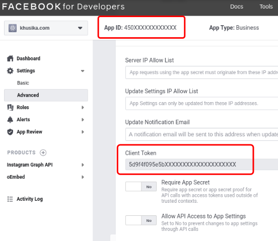

Hugo it self has built-in Instagram shortcode supports, but for some reason it can't be used anymore. In this article i will write about how to solve this problem in your Hugo environment.
<!--more-->

## Instagram Shortcode
If you are using Instagram shortcode in Hugo and having an issue with it, you are not the only one. Using Instagram shortcode with `` will generate an error like this:
```
Failed to get JSON resource "https://api.instagram.com/oembed/?url=https://instagram.com/p/BWNjjyYFxVx/&hidecaption=1": Failed to retrieve remote file: Bad Request
```

At the moment, Hugo using deprecated [oEmbed-legacy](https://developers.facebook.com/docs/instagram/oembed-legacy) linked API endpoint. Those deprecated API causes an error when Hugo retrieving the data. This is also happen with the _Hugo Continuous Integration_ build which force [Erik](https://bep.is/) to allow _getJSON errors_ to be ignored with this [commit](https://github.com/bep/hugo/commit/fdfa4a5fe62232f65f1dd8d6fe0c500374228788).

## Problem Solving
Facebook Developers lead us to use the newest Instagram [oEmbed](https://developers.facebook.com/docs/instagram/oembed) endpoint instead. This topic is being discused in [#7879](https://github.com/gohugoio/hugo/issues/7879). Using the newest API is required to create a Facebook App to generate _App ID_ and _Client Token_.

### Facebook App Configuration

1. Create an app in [Facebook Developers Page](https://developers.facebook.com/)
2. Add [_Instagram Graph API_](https://developers.facebook.com/docs/instagram-api/) and [_oEmbed_](https://developers.facebook.com/docs/plugins/oembed) to your facebook app
3. Don't forget to activate _oEmbed_ plugin

4. Find and copy _App ID_ in top left corner and use it for `.Site.Params.Instagram.AppId`
5. Go to Settings > Advanced > Security
6. Copy _Client Token_ and use it for `.Site.Params.Instagram.ClientToken`


### Theme Configuration
After you get both _App ID_ and _Client Token, follow these instruction below:

1. Create an `instagram.html` in `YourProject/layouts/shortcodes`
```html
{{- $appId := .Site.Params.Instagram.AppId -}}
{{- $clientToken := .Site.Params.Instagram.ClientToken -}}
{{ $id := .Get 0 }}
{{ $hideCaption := cond (eq (.Get 1) "hidecaption") "1" "0" }}
{{ with getJSON "https://graph.facebook.com/v10.0/instagram_oembed/?url=https://instagram.com/p/" $id "/&hidecaption=" $hideCaption "&access_token=" $appId "|" $clientToken }}{{ .html | safeHTML }}{{ end }}
```

2. Add front matter in `config.toml`:
```toml
[params.instagram]
  appId = "YourAppId"
  clientToken = "YourClientToken"
```

3. Create an example `instagram` input in your markdown:
```markdown

```

4. The rendered output will be like this:



At last, you can enjoy to use Instagram shortcode in Hugo without any problems. Have a good day! :wink:


There is also one other way to fix this apart from going through this theme by modifying the hugo template which I will explain in the other article.

