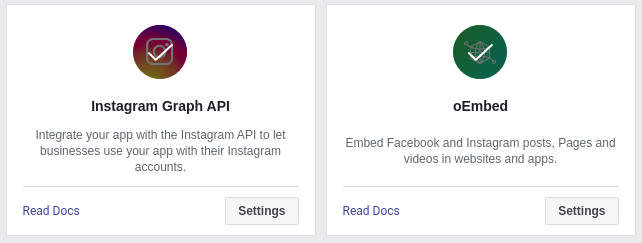

Hugo it self has built-in Instagram shortcode supports, but for some reason it can't be used anymore. In this article i will write about how to solve this problem in your Hugo environment.
<!--more-->


Facebook announced [**v11.0**](https://developers.facebook.com/docs/graph-api/changelog/version11.0) of the Graph API and Marketing APIs. With this update, there are new requirements to be able to access [**oEmbed APIs**](https://developers.facebook.com/docs/plugins/oembed/). To continue accessing the oEmbed APIs, you will have to [submit your app](https://developers.facebook.com/docs/plugins/oembed/) for review by **September 6th, 2021**. If you want to request new access to the oEmbed APIs, you will also need to submit your app(s) for review.


## Instagram Shortcode


Hugo version 0.84.0-DEV now requires Facebook access token to accesing Instagram oEmbed according to [this commit](https://github.com/gohugoio/hugo/commit/9b5debe4b820132759cfdf7bff7fe9c1ad0a6bb1). But, they are still using deprecated Facebook APIs [v8.0](https://developers.facebook.com/docs/graph-api/changelog/version8.0).


If you are using Instagram shortcode in Hugo and having an issue with it, you are not the only one. Using Instagram shortcode with `` will generate an error like this:
```
Failed to get JSON resource "https://api.instagram.com/oembed/?url=https://instagram.com/p/BWNjjyYFxVx/&hidecaption=1": Failed to retrieve remote file: Bad Request
```

At the moment, Hugo using deprecated [oEmbed-legacy](https://developers.facebook.com/docs/instagram/oembed-legacy) linked API endpoint. Those deprecated API causes an error when Hugo retrieving the data. This is also happen with the _Hugo Continuous Integration_ build which force [Erik](https://bep.is/) to allow _getJSON errors_ to be ignored with this [commit](https://github.com/bep/hugo/commit/fdfa4a5fe62232f65f1dd8d6fe0c500374228788).

## Problem Solving
Facebook Developers lead us to use the newest Instagram [oEmbed](https://developers.facebook.com/docs/instagram/oembed) endpoint instead. This topic is being discused in [#7879](https://github.com/gohugoio/hugo/issues/7879). Using the newest API is required to create a Facebook App to generate _App ID_ and _Client Token_.

### Facebook App Configuration

1. Create an app in [Facebook Developers Page](https://developers.facebook.com/)
2. Add [_Instagram Graph API_](https://developers.facebook.com/docs/instagram-api/) and [_oEmbed_](https://developers.facebook.com/docs/plugins/oembed) to your facebook app
3. Don't forget to activate _oEmbed_ plugin

4. Find and copy _App ID_ in top left corner and use it for `.Site.Params.oembed.appId`
5. Go to Settings > Advanced > Security
6. Copy _Client Token_ and use it for `.Site.Params.oembed.clientToken`


### Theme Configuration
After you get both _App ID_ and _Client Token, follow these instruction below:

1. Create an `oembed.html` in `YourProject/layouts/shortcodes`

   At this point we will integrate url query string parameter both Instagram Post and TV.
The `$type` parameter with `p` will stand for Instagram Post and `tv` for Instagram TV. The `ig` parameter will confirm that the oEmbed used is for Instagram.

   ```html
   {{- $oe := .Site.Params.oembed -}}
   {{- $appId := $oe.appId -}}
   {{- $clientToken := $oe.clientToken -}}
   {{- if not $oe.privacy -}}
   {{ $host := .Get 0 }}
   {{ $type := .Get 1 }}
   {{ $id := .Get 2 }}
   {{ $hideCaption := cond (eq (.Get 3) "hidecaption") "1" "0" }}
   {{ with getJSON "https://graph.facebook.com/v11.0/instagram_oembed/?url=https://instagram.com/" $type "/" $id "/&hidecaption=" $hideCaption "&access_token=" $appId "|" $clientToken }}{{ .html | safeHTML }}{{ end }}
   {{- end -}}
   ```

2. Add front matter in `config.toml`:
   ```toml
   [params.oembed]
     appId = "YourAppId"
     clientToken = "YourClientToken"
     privacy = false
   ```

3. Create an example `instagram` input in your markdown:

a. Sample input of Instagram Post

```markdown

```

b. Sample input of Instagram TV

```markdown

```

4. The rendered output will be like this:


Sample output may not work because Facebook API has been deactivated


a. Sample output of Instagram Post



b. Sample output of Instagram TV



---
At last, you can enjoy to use Instagram shortcode in Hugo without any problems. Have a good day! :wink:
