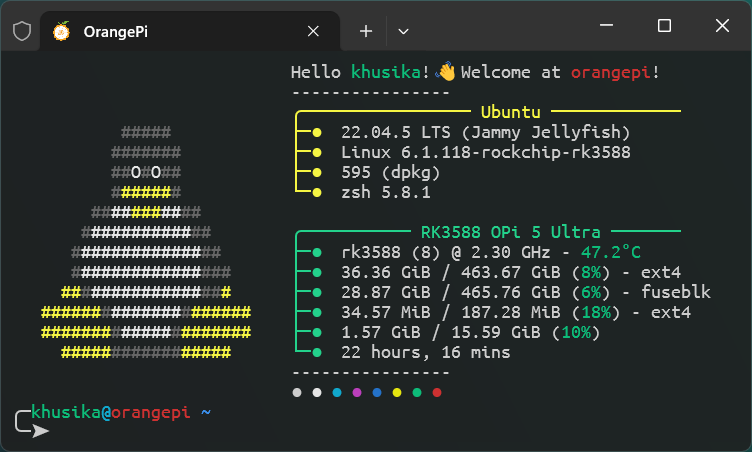

This project provides a Linux stable kernel fork specifically tailored for OrangePi devices using the Rockchip RK3588 and RK3588S processors.
<!--more-->

The OrangePi kernel ecosystem has received a significant upgrade, now merging the latest Linux stable releases on top of the official OrangePi Rockchip BSP kernel branch. This development, as illustrated in the attached picture below, showcases a modern and optimized OrangePi 5 Ultra environment running Ubuntu 22.04 LTS with the latest Linux 6.1.118 kernel, ensuring greater compatibility, up-to-date security patches, and robust support for new compilers and devices. These improvements help OrangePi users remain at the forefront of ARM SBC capabilities, combining advanced hardware monitoring and efficient resource management in daily use.

## Linux Stable Integration Over OrangePi BSP
The main development branch, [`dev/orange-pi-6.1-rk35xx`](https://github.com/khusika/linux_stable-orangepi/commits/dev/orange-pi-6.1-rk35xx), integrates upstream Linux stable releases (currently [`linux-6.1.y`](https://git.kernel.org/pub/scm/linux/kernel/git/stable/linux.git/log/?h=linux-6.1.y)) directly over the OrangePi-specific kernel. This means users benefit from:

- All upstream Linux stable patches for improved security and hardware support.
- Preservation of OrangePi and Rockchip-specific enhancements supplied in the BSP branch.
- Ongoing compatibility checks—ensuring stable daily operation on recent OrangePi boards.

The branch is actively updated in sync with upstream, with commit history reflecting substantial merges from the official stable trees as well as routine backports and bugfixes.​

## Stable Rockchip Kernel + GCC 14.3 Fixes
A separate branch, [`orange-pi-6.1-rk35xx`](https://github.com/khusika/linux_stable-orangepi/commits/orange-pi-6.1-rk35xx), serves as a reference for the community by providing a stable Rockchip BSP kernel merged on top of the OrangePi kernel. This branch was created by merging the Rockchip Linux upstream tree ([`develop-6.1`](https://github.com/rockchip-linux/kernel/tree/develop-6.1)) into the OrangePi kernel branch, producing a Rockchip-stable baseline with OrangePi-specific fixes. The branch implements:

- All vendor and mainline fixes for the RK35xx platform supported by OrangePi.
- Additional compatibility and build fixes for the latest [ARM GNU Toolchain](https://developer.arm.com/downloads/-/arm-gnu-toolchain-downloads) (14.3.Rel1), ensuring smooth compilation for recent toolchains.
- Stability and reliability improvements on top of regular Linux updates, allowing for production-level deployment and advanced development alike.

## Platform Support and Testing Status

This project is developed specifically for OrangePi single-board computers equipped with the Rockchip RK3588 and RK3588S chipsets.

- **Primary Target Devices**: OrangePi boards featuring RK3588/RK3588S SoCs, leveraging the high-performance CPU, GPU, and NPU capabilities of these platforms for advanced applications and compatibility with modern Linux kernels.
- **Tested Hardware**: All development and validation are performed on the Orange Pi 5 Ultra, ensuring reliable operation and hardware enablement for this model.
- **Development Focus**: While code may support other RK3588-powered boards, only the Orange Pi 5 Ultra is tested, making it the recommended device for users seeking maximum stability and support with these kernel releases.

## User Recommendations

- Both branches bridge upstream Linux features with board-specific enhancements, so users enjoy the best of both worlds: robust hardware enablement and community-driven innovation.
- The work includes proactive fixes for kernel build failures with newly released GCC toolchains—particularly relevant for developers transitioning to GCC 14.x.
- These repositories serve as a reliable base for both end-users seeking ready

## Getting Involved

Contributions, bug reports, and pull requests are welcome as the project continues to evolve with new kernel releases and community needs. Testing on different OrangePi variants, especially with recent mainline and BSP mixes, is highly appreciated to further enhance support for the broader ARM64 SBC community.

## References

- Branch details and commit logs: [`dev/orange-pi-6.1-rk35xx`](https://github.com/khusika/linux_stable-orangepi/commits/dev/orange-pi-6.1-rk35xx) | [`orange-pi-6.1-rk35xx`](https://github.com/khusika/linux_stable-orangepi/commits/orange-pi-6.1-rk35xx)
- Community context and discussion: [Reddit OrangePi Kernel Thread](https://www.reddit.com/r/OrangePI/comments/1lkthud/orangepi_kernel_forked_with_the_latest_stable_bsp/)
