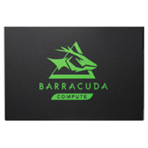
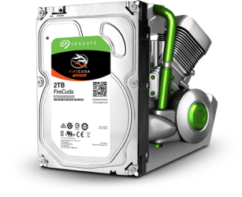
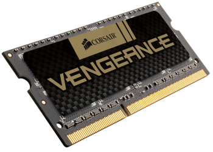
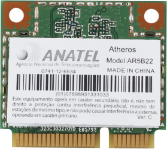

# Upgrade e014tx Hardware

Laptops are generally easy to perform minor upgrades on, but major hardware changes such as CPU and mainboard replacements are generally infeasible. In this section I will share my own expirience about upgrading HP Pavillion 14-e014tx also known as 15-e014tx.
<!--more-->

HP Pavillion 14-e014tx(similar with 15-e014tx series) brings minimum hardware specification for production use ([official product specification](https://support.hp.com/ee-en/document/c03773272)). For my daily use, this default hardware specification can not managed to build an android kernel well. Some of case will brings `Core Dump (Segmentation fault)`, because of that i was planning to upgrade some of upgradable hardware for production use.

## Replace Internal HDD with SSD
Official hardware driver bring HDD with 750GB storage in it. The idea of upgrading this hardware isn't the size of storage but the speed of read/write in SSD compared to HDD. These faster speeds lead to performance benefits in several areas, such as when logging in and waiting for apps and services to start up, or when performing storage-intensive tasks such as copying a large file. With an HDD, performance slows significantly, while an SSD can continue to work on other tasks.

Those good benefits of SSD in several areas made me to choose SSD as default storage in my laptop. For the reference, i choose to use _Seagate BarraCuda 120 SSD_ with 500GB of memory in it. In my case, these memory will be used as `~/root` or `Local Disk (C:)` with 50GB of memory in it and `~/home` or `Local Disk (D:)` with 450GB of memory in it. For the extra memory, i use HDD Caddy which will be explained in the next section. See the table below for driver specifications.


_[barracuda-120-sata-DS2022-1-1909US-en_US.pdf](https://www.seagate.com/www-content/datasheets/pdfs/barracuda-120-sata-DS2022-1-1909US-en_US.pdf)_

| Specifications | Description |
| -------------- | :---------: |
| Model Number | ZA500CM10003 |
| Interface | SATA 6Gb/s |
| NAND Flash Memory | 3D TLC |
| Sequential Read (Max, MB/s), 128KB | 560 |
| Sequential Write (Max, MB/s), 128KB | 540 |

## Replace DVD Driver with HDD Caddy
The e014tx series already shipped with DVD drive which is unnecessary for me. Most of us are already using flashdisk drive to transfer some data to other devices. Because of that i was planning to replace this drive with HDD Caddy. You can see lot of tutorial about it through [google.com](http://letmegooglethat.com/?q=Replace+HDD+Caddy).

In this case, the type of storage which i use with caddy is _Solid State Hybrid Drives (SSHD)_. SSHD brings _SSD performance with HDD capacity and affordable price_. For the reference, i choose to use _Seagate FireCuda SSHD_ with 1TB of memory in it. These memory will be used as extra data backup. See the table below for driver specifications.


_[firecuda-2-5-sshd-DS1908-2-2006US-en_US.pdf](https://www.seagate.com/www-content/datasheets/pdfs/firecuda-2-5-sshd-DS1908-2-2006US-en_US.pdf)_

| Specifications | Description |
| -------------- | :---------: |
| Model Number | ST1000LX015 |
| Interface | SATA 6Gb/s |
| Bytes per Sector (logical/physical) | 512/4096 |
| Data Transfer Rate (MB/s) | Up to 140 |
| Recording Technology | SMR |

## Upgrade RAM
HP Pavillion 14-e014tx (15-e014tx) shipped with 4GB _DDR3L_ of _Random Access Memory_ and dual slot of memory accessible. Upgrading a RAM depends on the type of CPU used, which in this type of laptop is based on _Intel (R) Core (TM) i5-3230M_. According to the [ark.intel.com](https://ark.intel.com/content/www/us/en/ark/products/72164/intel-core-i5-3230m-processor-3m-cache-up-to-3-20-ghz-rpga.html), this type of cpu can be upgraded to 32 GB of RAM.

For the production use in this laptop, upgrading RAM from 4GB to 16GB is enough for me. According to the [source.android.com](https://source.android.com/setup/build/requirements#hardware-requirements), we need at least 16 GB of available RAM/swap to build an android OS and kernel. For the reference, i choose to use _Corsair CMSX16GX3M2B1600C9_. This type of RAM brings a dual channel memory 2x8 GB with low voltage in it. See this table below for the data sheet.


_[CMSX16GX3M2B1600C9](https://www.corsair.com/eu/en/Categories/Products/Memory/Laptop-and-Notebook-Memory/Vengeance%C2%AE-%E2%80%94-16GB-High-Performance-Laptop-Memory-Upgrade-Kit/p/CMSX16GX3M2B1600C9#tab-tech-specs)_

| Specifications | Description |
| -------------- | :---------: |
| Memory Configuration | SODIMM |
| Memory Series | Vengeance |
| Memory Type | DDR3L |
| SPD Latency | 9-9-9-24 |
| SPD Speed | 1.35V |
| Speed Rating | PC3-12800 (1600MHz) |

## Upgrade WLAN Card
HP Pavillion 14-e014tx shipped with [Ralink RT3290](https://www.mediatek.com/products/broadbandWifi/rt3290), this WLAN Card integrated with bluetooth 4.0. For some reason in the Linux distribution, there is no compatibility with the blutooth module for RT3290 and also the WiFi network coverage is very poor. Because of that, i was trying to find replacement for this WLAN card.

There are lot of WLAN card with mini PCI-E in [online store](http://letmegooglethat.com/?q=Online+Store). I just found the hardware replacement with the [AR5B22](https://www.aliexpress.com/item/821973599.html). AR5B22 has more advantages than RT3290, support for Linux distribution is also very good with this wifi module. This driver integrated with _AR9462 Wireless Network Adapter_ and _Atheros AR3012 Bluetooth 4.0_.

